# Allegro Games

## About

The following games were implemented as part of the Programming Introduction Course at Cin-UFPE (Brazil 2012-2013). Sim City was implemented as my final project of the course. Later, as a teaching assistant, I implemented the other games as templates for the next students to understand the game requirements and implement their own.

All games were implemented using a C/C++ game library called [Allegro](https://www.allegro.cc/). It is pretty raw, having only simple graphics, sound and input libraries to work with. It served as a tool for students to learn the basics of programming as well as understand how UI elements are implemented in low abstraction level.

Although the code was written by me, most game assets, including sprites, music and sound effects were taken from other proprietary sources so the software here presented should only be used as a learning tool. 

## Instructions

To run the games, extract its `.zip` file located on the `Binaries` folder and execute the `.exe` file.

To compile from source on windows there are projects for the [CodeBlocks](http://www.codeblocks.org/) IDE on Source folder. All projects require Allegro library installed (4.4.2 or 5.2.x depending on the game).

## Screenshots

### Bomberman
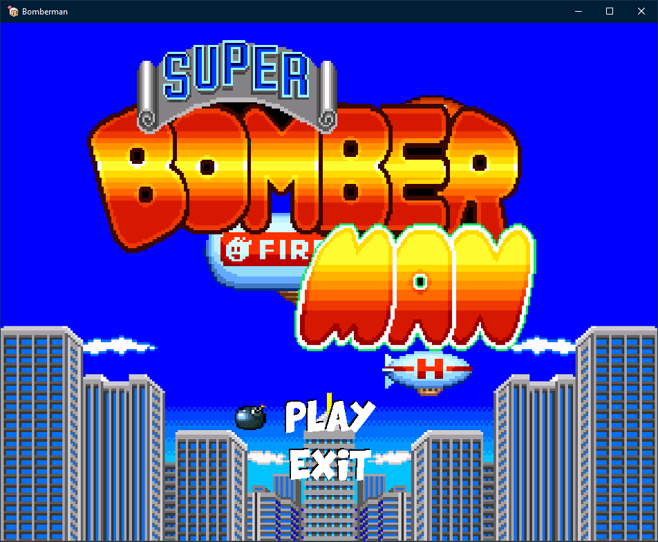
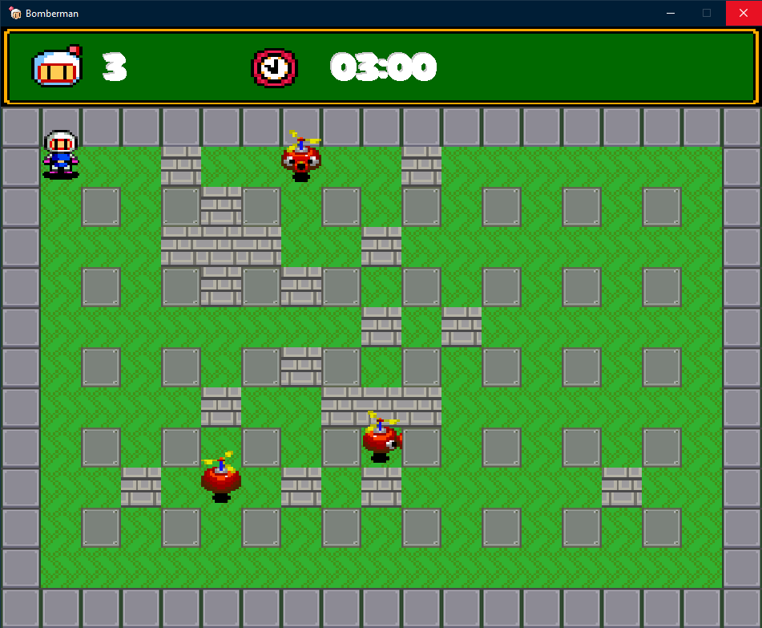

### Last Survivor
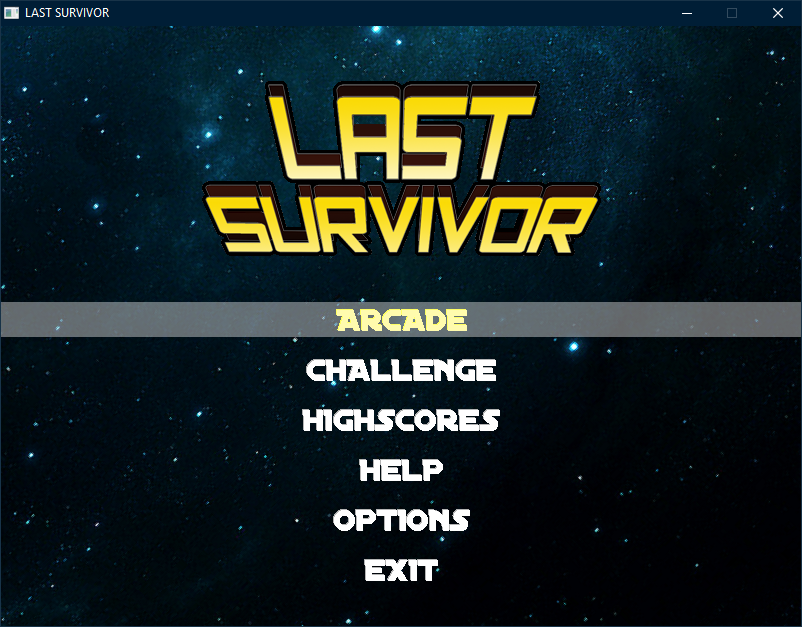
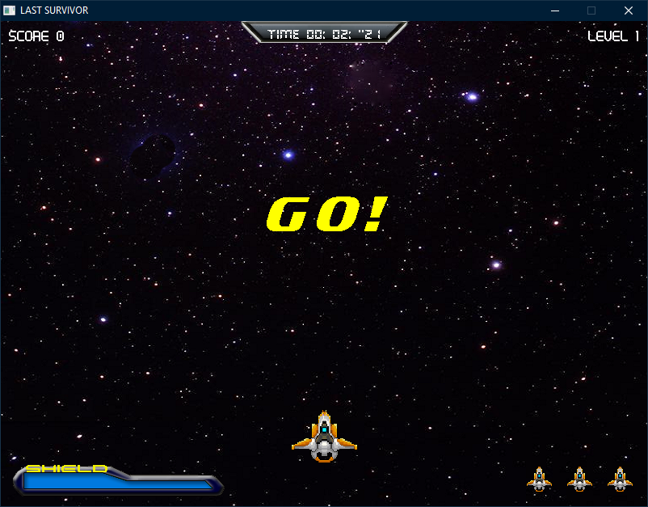

### Sim City
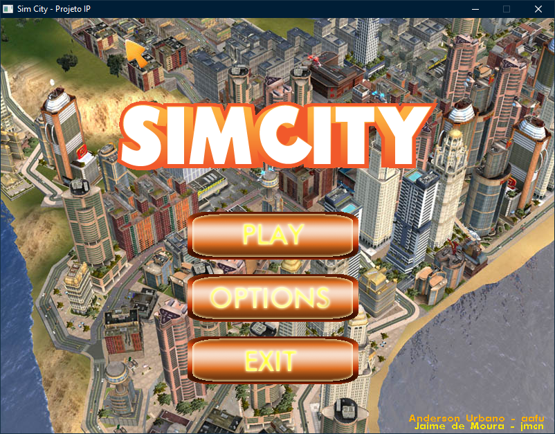
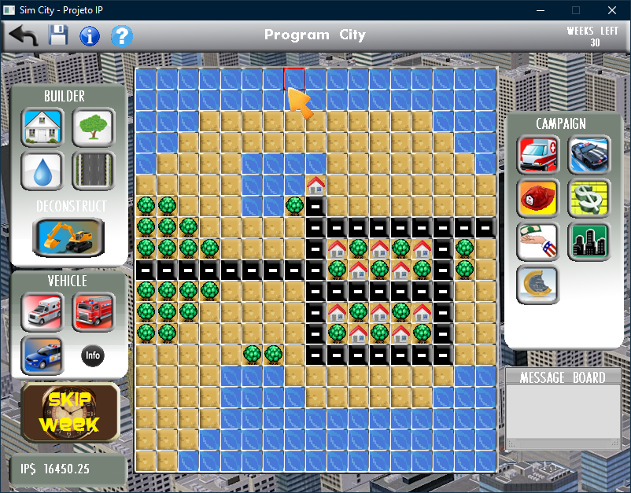

### Tower Defense
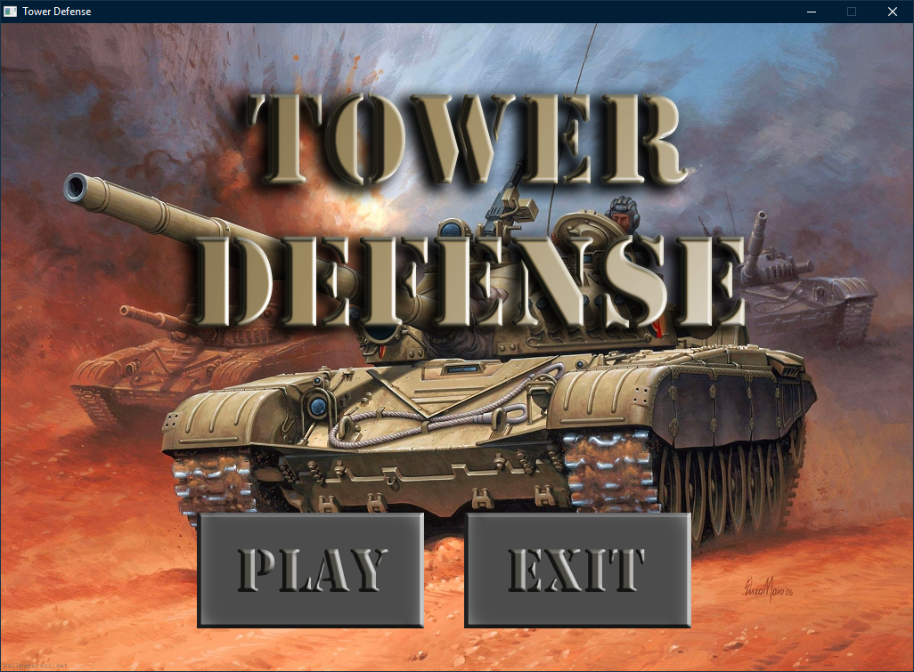
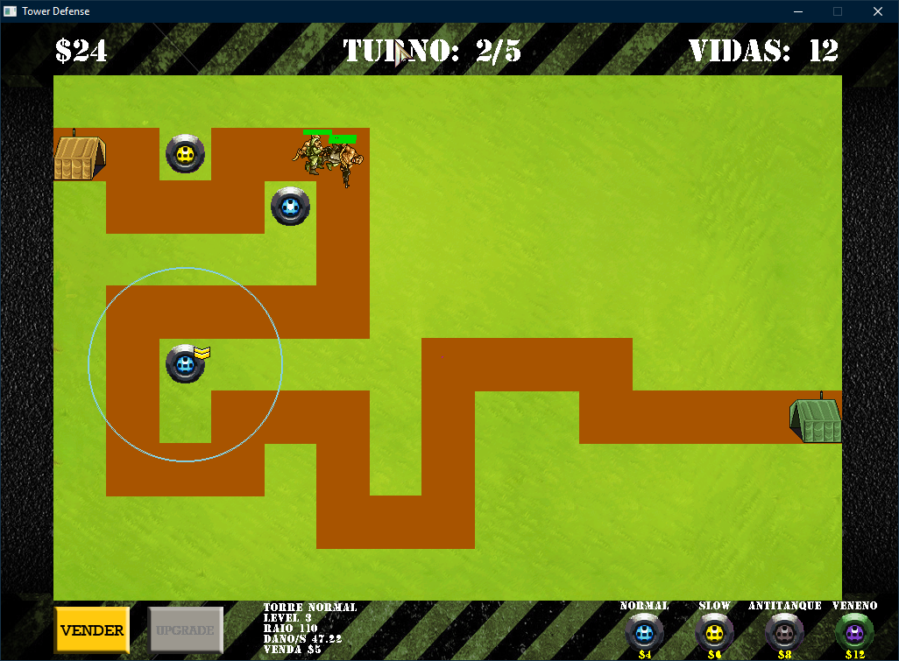

### Extras
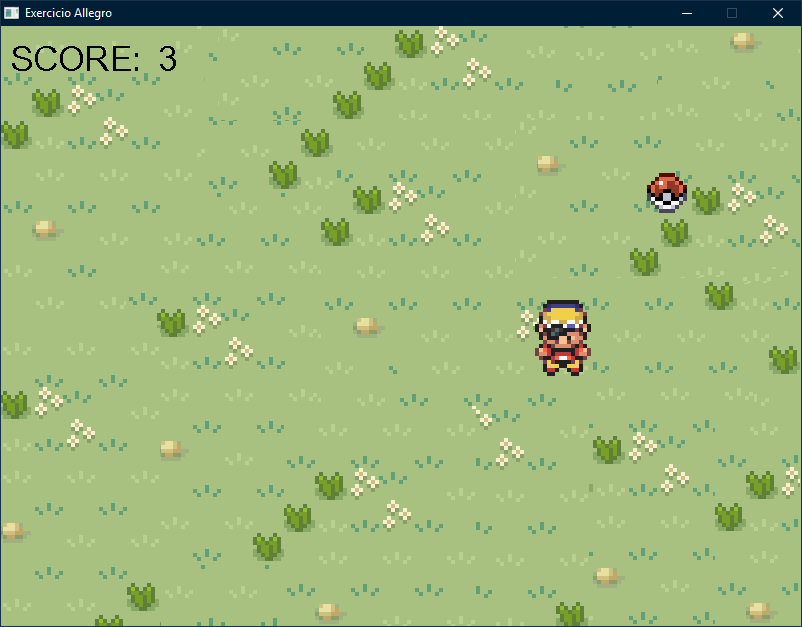
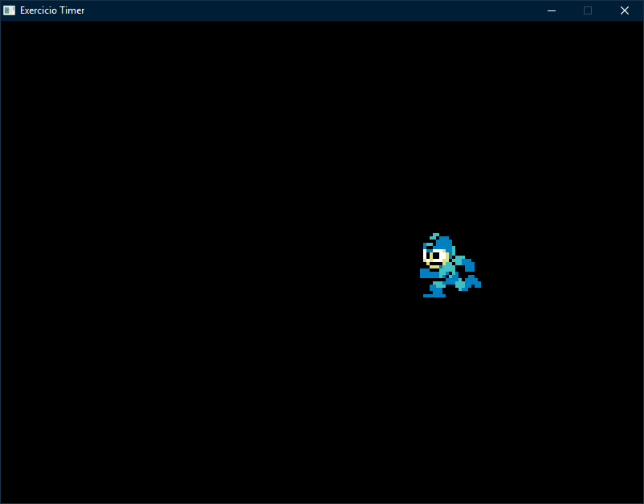
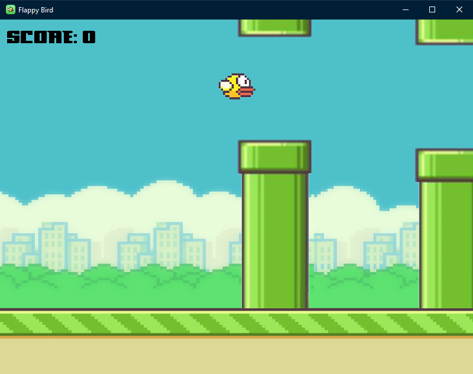
